# 前端大屏自适应项目技术文档

## 1. 整体设计思路

### 1.1 设计目标

- 实现基于1920x1080基础尺寸的响应式大屏布局
- 确保在不同尺寸和比例的屏幕上都能保持良好的显示效果
- 提供灵活的缩放机制，支持不同分辨率（如1080P、2K、4K、 8K等）
- 保持UI元素的相对位置和比例一致性
- 支持图表等复杂组件的自适应显示

**设计目标解释**：选择1920x1080作为基础尺寸是因为它是当前最常用的设计稿尺寸，能够很好地平衡清晰度和兼容性。支持多种分辨率是为了适应不同场景下的显示设备，从普通显示器到大型拼接屏。

### 1.2 核心设计理念

- **基础尺寸锚定**：以1920x1080作为设计稿基础尺寸，所有元素尺寸基于此计算
- **双维度适配**：同时考虑宽度和高度的适配，选择合适的缩放比例
- **CSS变量驱动**：使用CSS变量存储关键尺寸和缩放比例，便于动态调整
- **组件化设计**：将大屏拆分为可复用组件，每个组件内部实现自适应逻辑
- **主题支持**：支持暗黑/亮色主题切换

**设计理念解释**：

- **基础尺寸锚定**：确保设计稿与实际开发的一致性，减少换算误差
- **双维度适配**：避免单一维度适配导致的内容裁剪或空白问题
- **CSS变量驱动**：实现样式的集中管理和动态调整，提高维护效率
- **组件化设计**：降低耦合度，提高代码复用性和可维护性
- **主题支持**：满足不同场景下的视觉需求，提高用户体验

### 1.3 技术架构

- **前端框架**：Vue 3 + TypeScript
- **样式预处理器**：SCSS
- **响应式方案**：自定义Hooks + CSS Transform + CSS变量
- **图表库**：ECharts
- **状态管理**：Pinia

**技术架构解释**：

- **Vue 3 + TypeScript**：提供了更好的类型安全和组件化支持，适合大型复杂应用
- **SCSS**：提供变量、函数、混合等高级特性，便于实现复杂的样式逻辑
- **自定义Hooks + CSS Transform + CSS变量**：结合JavaScript的动态计算能力和CSS的样式表现能力，实现灵活的响应式效果
- **ECharts**：提供丰富的图表类型和良好的自适应支持，适合数据可视化场景
- **Pinia**：轻量级状态管理库，适合管理应用的全局状态

## 2. 实现思路

### 2.1 响应式缩放机制

#### 2.1.1 基于CSS Transform的缩放

核心实现位于 `use-resize.ts`钩子中，通过计算浏览器窗口与设计稿的宽高比，动态设置缩放比例：

```typescript
// 计算宽高缩放比例
const scaleW = clientWidth / w;
const scaleH = clientHeight / h;

if (clientWidth / clientHeight > w / h) {
    // 如果浏览器的宽高比大于设计稿的宽高比，就取浏览器高度和设计稿高度之比
    scale.value = scaleH;
} else {
    // 如果浏览器的宽高比小于设计稿的宽高比，就取浏览器宽度和设计稿宽度之比
    scale.value = scaleW;
}

// 应用缩放
if (screenRef.value) {
    screenRef.value.style.transform = `scale(${scale.value})`;
    // 更新CSS变量，方便其他组件使用
    document.documentElement.style.setProperty('--current-scale', scale.value.toString());
}
```

**设计解释**：

- **宽高比判断**：通过比较浏览器和设计稿的宽高比，选择较小的缩放比例，确保内容完整显示
- **CSS Transform应用**：使用transform: scale()实现整体缩放，避免了重排和重绘，性能更好
- **CSS变量更新**：将缩放比例存储到CSS变量中，方便其他组件获取和使用

这种设计确保了大屏内容在不同尺寸的屏幕上都能保持完整显示，同时避免了内容变形。

#### 2.1.2 基于缩放比例的响应式尺寸

在 `screen.scss` 中定义了基于缩放比例的响应式尺寸系统，将设计稿尺寸转换为实际显示尺寸。该系统主要包含三个核心部分：

##### 2.1.2.1 基础配置变量

定义了适配方案的基础参数，作为整个缩放系统的计算基准：

```scss
// 大屏适配方案：基于1920x1080基础尺寸的响应式缩放
// 定义基础比例变量，可快速切换不同分辨率适配
$screen-scale: 2; // 4K: 2, 1080P: 1, 2K: 1.5 等
$screen-base-width: 1920px;
$screen-base-height: 1080px;
```

##### 2.1.2.2 响应式尺寸函数

封装了尺寸缩放的核心逻辑，提供简洁的API供组件使用：

```scss
/**
 * 计算缩放尺寸的全局函数
 * @param $size 原始尺寸
 * @return 缩放后的尺寸
 */
@function scale-size($size) {
    @return $size * $screen-scale;
}
```

##### 2.1.2.3 设计解释

- **基础比例变量**：通过 `$screen-scale` 控制整体缩放比例，方便快速切换不同分辨率适配（如4K屏使用2倍缩放，1080P屏使用1倍缩放）
- **基础尺寸定义**：明确设计稿的基础尺寸（1920x1080），作为缩放计算的基准
- **缩放函数封装**：通过 `scale-size()` 函数封装缩放逻辑，提高代码复用性和可维护性

这种基于缩放比例的方案与 CSS Transform 缩放机制形成互补，前者用于静态样式尺寸计算，后者用于运行时动态调整整个大屏内容的缩放比例。

### 2.2 布局结构设计

#### 2.2.1 整体布局

采用三栏布局结构：

- 顶部导航栏
- 左侧区域
- 中央区域
- 右侧区域

```html
<div class="big-screen-container">
    <div class="big-screen">
        <header />
        <div class="big-screen-main">
            <div class="big-screen-left">...</div>
            <div class="big-screen-center">...</div>
            <div class="big-screen-right">...</div>
        </div>
    </div>
</div>
```

**设计解释**：

- **容器嵌套结构**：通过两层容器实现整体缩放和内容布局的分离
- **三栏布局**：符合大屏应用的常见布局需求，便于信息的分类展示
- **组件化拆分**：将不同区域拆分为独立组件，提高代码复用性和可维护性

这种布局结构清晰明了，便于扩展和维护，适合大多数大屏应用场景。

#### 2.2.2 CSS变量系统

定义了一套完整的CSS变量系统，用于统一管理尺寸、间距、字体等样式属性：

```scss
:root {
    // 缩放比例
    --big-screen-scale: #{$scale};
    // 屏幕尺寸
    --big-screen-width: #{$base-width * $scale};
    --big-screen-height: #{$base-height * $scale};
    // 基础布局尺寸
    --big-header-height: #{screen.scale-size($base-header-height)};
    // 间距尺寸
    --big-padding-16: #{screen.scale-size(16px)};
    // 字体大小
    --big-font-size: #{screen.scale-size(14px)};
    // 图标和边框
    --big-icon-size: #{screen.scale-size(30px)};
    // 颜色变量
    --big-block-bg: #222733;
}
```

**设计解释**：

- **集中管理**：将所有可配置的样式属性集中到CSS变量中，便于统一管理和调整
- **动态计算**：通过SCSS函数动态计算变量值，确保样式的一致性
- **分层分类**：按照功能和用途对变量进行分类，提高可读性和可维护性

CSS变量系统是实现主题切换和动态样式调整的基础，同时也提高了代码的可维护性和扩展性。

### 2.3 组件自适应实现

每个组件内部通过以下方式实现自适应：

1. **使用CSS变量**：引用全局定义的CSS变量
2. **响应式尺寸函数**：使用 `screen.scale-size()` 函数
3. **动态计算**：在需要时通过JavaScript动态计算尺寸

例如，在 `header.vue`中：

```scss
.big-screen-header {
    // 使用screen.scale-size函数计算缩放后的尺寸
    --header-title-width: #{screen.scale-size(487px)};
    --header-title-letter-spacing: #{screen.scale-size(7px)};
    --header-title-text-shadow: 0px #{screen.scale-size(2px)} #{screen.scale-size(20px)}
        rgba(222, 171, 155, 0.6);

    // 其他样式...
}
```

**设计解释**：

- **CSS变量应用**：在组件内部使用CSS变量定义局部样式，便于调整和维护
- **响应式尺寸计算**：使用响应式尺寸函数确保组件在不同尺寸下的一致性
- **局部变量定义**：通过局部CSS变量隔离组件样式，避免样式冲突

组件自适应实现策略确保了每个组件都能独立地适应不同的屏幕尺寸，同时保持与整体设计的一致性。

### 2.4 方案对比与选择

在实现大屏自适应方案时，对比了两种主要的实现方式：基于CSS Transform的px整体缩放方案和基于vw/vh单位的百分比方案。以下是两种方案的详细对比分析：

#### 2.4.1 当前实现：基于CSS Transform的px缩放方案

**核心机制**：

- 以1920x1080为基础尺寸，使用 `transform: scale()`对整个大屏容器进行统一缩放
- 通过 `use-resize.ts`钩子根据屏幕尺寸动态计算缩放比例
- 提供 `scale-size()` SCSS函数实现静态尺寸的快速转换
- 使用CSS变量统一管理所有缩放后的尺寸值

**优势**：

- **代码简洁**：直接使用熟悉的px单位，易于理解和编写
- **比例一致性**：整体缩放保持设计稿的原始比例关系
- **统一控制**：只需要在一处修改缩放比例，所有元素自动适配
- **图表友好**：ECharts等图表库通过简单配置即可实现自适应
- **调试方便**：可以直接使用浏览器开发者工具查看和修改原始尺寸
- **性能优化**：使用CSS Transform缩放避免重排和重绘，性能更好

**典型应用**：

```vue
<template>
    <div :class="['big-screen-container', store.theme]">
        <div ref="screenRef" class="big-screen">
            <!-- 大屏内容 -->
        </div>
    </div>
</template>

<script setup lang="ts">
import { useResize } from '../../hooks/use-resize';
const { screenRef } = useResize();
</script>

<style scoped lang="scss">
.big-screen {
    width: var(--big-screen-width);
    height: var(--big-screen-height);
    // 其他样式使用CSS变量或scale-size()函数
}
</style>
```

#### 2.4.2 备选方案：基于vw/vh的百分比方案

**核心机制**：

- 将所有设计稿尺寸转换为vw/vh单位（1920px → 100vw，1080px → 100vh）
- 元素间的间距、字体大小等使用不同的vw/vh值以保持比例
- 需要为每个元素单独设置响应式尺寸

**劣势**：

- **繁琐的单位转换**：每个尺寸都需要手动计算vw/vh值
- **复杂的比例关系**：不同元素需要设置不同的vw/vh值以保持设计比例
- **图表适配困难**：ECharts等图表库需要额外的响应式配置
- **小数像素问题**：计算结果可能出现小数像素，导致字体或边框模糊
- **维护成本高**：修改设计尺寸时需要重新计算所有相关元素的vw/vh值
- **布局复杂性**：需要处理元素间的复杂依赖关系和比例

#### 2.4.3 选择结论

通过对比分析，我们选择了**基于CSS Transform的px缩放方案**，主要原因如下：

1. **开发效率**：使用熟悉的px单位，减少了复杂的单位转换和计算
2. **维护成本**：统一的缩放机制使得修改和维护更加便捷
3. **视觉一致性**：整体缩放确保了设计稿的原始视觉效果和比例关系
4. **图表兼容性**：与ECharts等图表库的适配更加简单
5. **性能表现**：CSS Transform缩放的性能优于大量使用vw/vh单位的布局

这种方案在保证自适应效果的同时，大大降低了开发和维护的复杂性，是大屏自适应场景下的理想选择。

## 3. 图表的样式计算逻辑整理

### 3.1 图表尺寸计算工具函数

在 `utils/calculate.ts`中提供了图表相关的尺寸计算函数：

```typescript
/**
 * 获取当前屏幕缩放比例
 * 优先从CSS变量读取，否则使用默认值
 */
export function getCurrentScale(): number {
    // 尝试从CSS变量获取当前缩放比例
    const cssScale = window
        .getComputedStyle(document.documentElement)
        .getPropertyValue('--current-scale')
        .trim();

    if (cssScale && cssScale !== 'undefined') {
        const parsedScale = parseFloat(cssScale);
        if (!isNaN(parsedScale) && isFinite(parsedScale)) {
            return parsedScale;
        }
    }
    // 默认返回2（4K缩放比例）
    return 2;
}

/**
 * 计算字体大小
 * @param size 基础字体大小（可选，默认为14px）
 * @returns 缩放后的字体大小
 */
export function getFontSize(size: number = 14): number {
    return size * getCurrentScale();
}

/**
 * 计算图表相关尺寸
 * @param size 基础尺寸（可选，默认为14px）
 * @returns 缩放后的尺寸
 */
export function getChartSize(size: number = 14): number {
    return size * getCurrentScale();
}
```

**设计解释**：

- **缩放比例获取**：优先从CSS变量获取缩放比例，确保与整体缩放保持一致
- **默认值处理**：提供默认值确保在CSS变量不可用时的兼容性
- **函数分离**：将字体大小和图表尺寸计算分离，提高代码的可读性和可维护性

图表尺寸计算工具函数是实现图表自适应的核心，确保图表元素在不同缩放比例下都能保持合适的大小和比例。

### 3.2 图表配置中的自适应实现

在图表配置中，通过调用上述工具函数来实现尺寸的自适应：

#### 3.2.1 饼图示例（right/center.vue）

```typescript
import { getFontSize, getChartSize, getCurrentScale } from '../../utils/calculate';

// 计算标题字体大小
const titleFontSize = (480 / 100) * 3.6 * getCurrentScale();
// 计算内半径和外半径
const innerRadius = titleFontSize * 2.8;
const outerRadius = innerRadius * 1.125;

// 图表配置
const option = {
    series: [
        {
            type: 'pie',
            center: ['50%', '40%'],
            radius: [outerRadius, innerRadius],
            // 其他配置...
            label: {
                position: 'center',
                color: colorArr[index][0],
                fontSize: titleFontSize / 1.2
            }
        }
};
```

**设计解释**：

- **标题字体大小计算**：基于容器尺寸和缩放比例动态计算标题大小
- **半径计算**：根据标题大小动态计算饼图的内半径和外半径，确保比例协调
- **字体大小调整**：对不同元素的字体大小进行微调，确保视觉效果

这种设计确保了饼图在不同尺寸下都能保持良好的可读性和视觉效果。

#### 3.2.2 柱状图示例（left/bottom.vue）

```typescript
import { getFontSize, getChartSize } from '../../utils/calculate';

// 图表配置
const option = {
    // 其他配置...
    legend: {
        // 其他配置...
        textStyle: {
            color: '#aaa',
            fontSize: getFontSize()
        }
    },
    tooltip: {
        // 其他配置...
        textStyle: {
            fontSize: getFontSize(14),
            color: '#333'
        },
        borderWidth: getChartSize(1),
        padding: getChartSize(10)
    },
    series: [
        {
            // 其他配置...
            label: {
                show: true,
                position: 'right',
                fontSize: getFontSize(),
                color: '#FFF',
                fontWeight: 'bold'
            },
            barWidth: barWidth
        }
    ]
};
```

**设计解释**：

- **字体大小适配**：对图例、提示框、标签等文本元素的字体大小进行适配
- **边框和内边距适配**：对提示框的边框宽度和内边距进行适配，确保视觉效果
- **柱状图宽度动态调整**：根据数据量和容器宽度动态调整柱状图宽度，避免过宽或过窄

这种设计确保了柱状图在不同尺寸下都能保持良好的可读性和视觉效果。

#### 3.2.3 环形图示例（right/top.vue）

```typescript
import { getFontSize } from '../../utils/calculate';

// 图表配置
const option = {
    // 其他配置...
    legend: {
        // 其他配置...
        textStyle: {
            color: '#aaa',
            fontSize: getFontSize()
        }
    }
    // 其他配置...
};
```

**设计解释**：

- **图例字体大小适配**：对图例的字体大小进行适配，确保可读性

环形图的自适应实现相对简单，主要关注文本元素的字体大小适配。

### 3.3 图表自适应策略

1. **字体大小自适应**：所有图表文本使用 `getFontSize()`函数计算
2. **图表元素尺寸自适应**：图表元素（如柱状图宽度、饼图半径）使用 `getChartSize()`或 `getCurrentScale()`计算
3. **布局自适应**：通过动态计算图表容器尺寸和内部元素比例
4. **响应式重绘**：在窗口大小变化时，图表会自动重绘以适应新的尺寸

**设计解释**：

- **分层适配**：从字体大小到图表元素尺寸再到布局，实现全面的自适应
- **动态计算**：根据当前缩放比例动态计算各项尺寸，确保一致性
- **自动重绘**：在窗口大小变化时自动重绘图表，确保实时响应

图表自适应策略确保了图表在不同尺寸和缩放比例下都能保持良好的可读性和视觉效果，是大屏应用中数据可视化的重要保障。

## 4. 系统设计技术图

```
┌─────────────────────────────────────────────────────────────────┐
│                      大屏自适应系统架构                         │
├─────────────────────────────────────────────────────────────────┤
│                           基础层                                │
├─────────┬──────────────────────────────┬────────────────────────┤
│ 基础尺寸 │          CSS变量系统         │        主题系统        │
│ (1920x1080) │ （尺寸、间距、字体、颜色） │ （暗黑/亮色切换）       │
└─────────┴──────────────────────────────┴────────────────────────┘
         │                   │                    │
         ▼                   ▼                    ▼
┌─────────────────────────────────────────────────────────────────┐
│                          核心层                                 │
├─────────────────────────────┬───────────────────────────────────┤
│      响应式缩放机制          │         响应式尺寸函数           │
│ （use-resize Hook + CSS Transform） │ （scale-size 函数） │
└─────────────────────────────┴───────────────────────────────────┘
         │                   │
         ▼                   ▼
┌─────────────────────────────────────────────────────────────────┐
│                          组件层                                 │
├──────┬──────────┬─────────────┬───────────┬─────────────────────┤
│ 布局组件 │ 头部组件 │   左侧组件    │   中央组件  │     右侧组件        │
└──────┴──────────┴─────────────┴───────────┴─────────────────────┘
         │                   │                    │
         ▼                   ▼                    ▼
┌─────────────────────────────────────────────────────────────────┐
│                          图表层                                 │
├──────────┬───────────┬───────────┬───────────┬──────────────────┤
│ 地图组件 │ 饼图组件  │ 环形图组件 │ 柱状图组件 │ 图表工具函数      │
│          │           │           │           │ （getFontSize等） │
└──────────┴───────────┴───────────┴───────────┴──────────────────┘
         │                   │                    │
         ▼                   ▼                    ▼
┌─────────────────────────────────────────────────────────────────┐
│                          应用层                                 │
├─────────────────────────────────────────────────────────────────┤
│                      大屏应用入口                               │
│                  （big-screen/index.vue）                        │
└─────────────────────────────────────────────────────────────────┘
```

### 4.1 系统各层说明

1. **基础层**：提供系统的基础配置，包括基础尺寸、CSS变量系统和主题系统
2. **核心层**：实现响应式缩放的核心逻辑，包括缩放机制和尺寸转换函数
3. **组件层**：构建大屏的各个组件，包括布局组件和功能组件
4. **图表层**：实现各种图表组件，支持自适应显示
5. **应用层**：大屏应用的入口，整合所有组件和功能

**设计解释**：

- **分层设计**：将系统分为不同层次，每层负责特定的功能，提高系统的可维护性和可扩展性
- **依赖关系**：上层依赖下层，下层为上层提供服务，形成清晰的调用关系
- **职责分离**：每层职责明确，避免功能交叉和耦合

分层设计是大型应用的常见架构模式，便于团队协作和系统维护。

### 4.2 数据流与交互

1. **初始化流程**：

   - 大屏应用加载，初始化基础配置
   - 应用主题和基础尺寸
   - 计算初始缩放比例并应用
2. **响应式流程**：

   - 窗口大小变化触发resize事件
   - use-resize Hook计算新的缩放比例
   - 更新CSS变量 `--current-scale`
   - 应用新的缩放比例到DOM元素
   - 图表组件根据新的缩放比例重绘
3. **主题切换流程**：

   - 用户点击主题切换按钮
   - 更新Pinia状态中的theme属性
   - 应用新的CSS变量（颜色相关）
   - 图表组件根据新主题重绘

**设计解释**：

- **单向数据流**：数据流清晰明确，便于追踪和调试
- **事件驱动**：通过事件触发响应式更新，提高系统的响应性
- **状态管理**：使用Pinia管理全局状态，确保状态的一致性

数据流与交互设计确保了系统在不同场景下的稳定性和响应性，是系统正常运行的重要保障。

## 5. 技术架构图

### 5.1 整体架构概览


### 5.2 自适应核心模块架构


### 5.3 大屏组件架构


### 5.4 自适应缩放流程


### 5.5 响应式尺寸计算流程


### 5.6 状态管理架构


## 6. 系统流程图


## 7. 数据流图

```mermaid
flowchart TD
    subgraph "数据来源"
        MockData[模拟数据JSON]
        API[后端API]
        LocalStorage[本地存储]
        Config[配置文件]
    end

    subgraph "数据处理层"
        DataLoader[数据加载器]
        DataParser[数据解析器]
        DataTransformer[数据转换器]
        Store[Pinia状态管理]
    end

    subgraph "业务组件层"
        BigScreen[大屏主组件]
        Header[顶部组件]
        Left[左侧组件]
        Center[中央组件]
        Right[右侧组件]
    end

    subgraph "展示层"
        Charts[图表组件]
        Maps[地图组件]
        Cards[卡片组件]
        Texts[文本组件]
    end

    MockData --> DataLoader
    API --> DataLoader
    LocalStorage --> DataLoader
    Config --> DataLoader

    DataLoader --> DataParser
    DataParser --> DataTransformer
    DataTransformer --> Store

    Store --> BigScreen
    Store --> Header
    Store --> Left
    Store --> Center
    Store --> Right

    Left --> Charts
    Center --> Maps
    Center --> Charts
    Right --> Charts
    Header --> Texts
    Left --> Cards
    Right --> Cards
```



## 8. 技术栈图


## 9. 组件依赖关系图


## 10. 自适应系统工作流程图


## 11. 总结与展望

### 11.1 已实现功能

- [X] 基于1920x1080的响应式大屏布局
- [X] 自动缩放机制，支持不同尺寸屏幕
- [X] 完整的CSS变量系统
- [X] 主题切换功能
- [X] 图表组件的自适应显示
- [X] 组件化设计，便于维护和扩展

**实现总结**：本方案成功实现了大屏应用的自适应功能，支持不同尺寸和比例的屏幕，保持了UI元素的相对位置和比例一致性，同时支持图表等复杂组件的自适应显示。

### 11.2 优化方向

- [ ] 性能优化：减少resize事件触发次数
- [ ] 更精细的缩放控制：支持局部区域的独立缩放
- [ ] 更多主题支持：提供多种预设主题
- [ ] 可视化配置：提供拖拽式的大屏配置界面
- [ ] 导出功能：支持将大屏导出为图片或PDF

**优化展望**：未来可以进一步优化系统的性能和功能，提高用户体验和开发效率。性能优化可以减少resize事件的触发次数，提高系统的响应速度；更精细的缩放控制可以满足特殊场景的需求；可视化配置可以降低大屏开发的门槛；导出功能可以方便用户保存和分享大屏内容。

## 使用说明

1. **查看图表**：

   - 安装VS Code扩展："Markdown Preview Mermaid Support"
   - 右键点击文件，选择"Open Preview"或使用快捷键 `Cmd+Shift+V`(Mac)或 `Ctrl+Shift+V`(Windows)
   - 或复制Mermaid代码到[Mermaid Live Editor](https://mermaid.live/)进行渲染
2. **系统特点总结**：

   - **模块化设计**：清晰的组件分层和职责划分
   - **高效自适应**：基于窗口尺寸的实时响应和精确缩放
   - **数据驱动**：统一的数据处理和状态管理
   - **可扩展架构**：便于添加新组件和功能
   - **高性能渲染**：优化的图表渲染和交互处理
